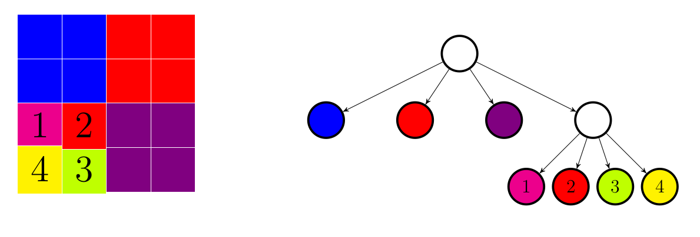
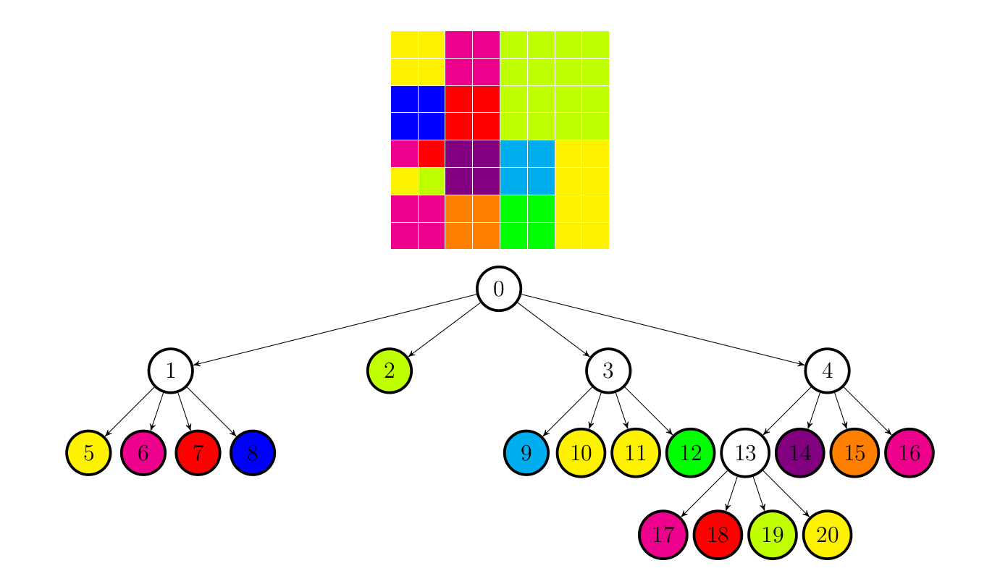

# Quad Tree


Arborele cuaternar este o structură de date care organizează informații
multidimensionale, **fiind utilizată** în **cartografie**, **procesarea imaginilor**,
**grafică pe calculator** etc.

Structura este un arbore ce reprezintă o zonă din spațiul N-dimensional
(în cadrul acestui proiect, cazul N = 2). Fiecare nod al arborelui păstrează
informații pentru o zonă din spațiu, iar nodul are `2^N` fii, care reprezintă
fiecare o zonă de `2^N` ori mai mică decât zona părintelui. Zonele fiilor sunt
disjuncte, iar reuniunea lor formează zona părintelui.

Cu alte cuvinte, structura pe care o vom utiliza în cadrul acestei teme este
un arbore în care fiecare nod neterminal are exact **4 descendenți**.

## Algoritmul de compresie

Orice imagine pătrată, de dimensiune putere a lui 2, poate fi reprezentată
printr-un arbore cuaternar. Nodurile de pe fiecare nivel al arborelui corespund
unei împărțiri a unei zone pătrate din imagine în patru sferturi.

- Rădăcina arborelui → întreaga imagine
- Nivelul 1 → cele patru sferturi (ordinea: **stânga sus, dreapta sus, dreapta jos, stânga jos**)
- Nivelul 2 → fiecare sfert este împărțit din nou în patru
- Procesul continuă până când zonele sunt **uniforme**

Dacă o regiune pătrată este **uniformă** (formată din pixeli identici), nodul
devine **frunză** și stochează culoarea. Dacă nu este uniformă, se
subdivizează și nodul devine **neterminal**, având patru descendenți.

Exemplu de vizualizare:

<p align="center">
    
</p>

<p align="center">
    
</p>


### Formula pentru culoarea medie

Pentru a determina când un bloc poate fi reprezentat ca nod frunză, se calculează
**culoarea medie** a blocului. Pentru fiecare canal (RED, GREEN, BLUE) se face
media aritmetică a valorilor din submatricea de pixeli corespunzătoare blocului.


```math
red = \frac{1}{size \cdot size} \left( \sum_{i=x}^{x+size} \sum_{j=y}^{y+size} grid[i][j].red \right)
```
```math
green = \frac{1}{size \cdot size} \left( \sum_{i=x}^{x+size} \sum_{j=y}^{y+size} grid[i][j].green \right)
```
```math
blue = \frac{1}{size \cdot size} \left( \sum_{i=x}^{x+size} \sum_{j=y}^{y+size} grid[i][j].blue \right)
```


### Formula pentru scorul similarității

După calcularea culorii medii, se determină **scorul de similaritate** al
blocului, prin diferența pătratică medie între pixeli și culoarea medie.

```math
mean = \frac{1}{3 \cdot size^2} 
       \big(  \sum_{i=x}^{x+size} \sum_{j=y}^{y+size} 
       (red - grid[i][j].red)^2 
           + (green - grid[i][j].green)^2 
           + (blue - grid[i][j].blue)^2 \big)
```

> `red`, `green` și `blue` reprezintă componentele culorii medii.


## Fisierul PPM

Un fișier **PPM** conține:
1. Antet text:
   - **Linia 1:** tipul fișierului (pentru testele folosite → `P6`)
   - **Linia 2:** două numere (width și height), separate prin spațiu
   - **Linia 3:** valoarea maximă a culorii (în testele folosite → `255`)
2. Imaginea propriu-zisă, în **format binar**.

> Imaginile utilizate sunt **pătratice** și au dimensiuni **putere a lui 2**.


Exemplu fișier PPM:

```txt
P6
512 512
255
<date binare>
```


## Fisierul comprimat

Pentru arborele rezultat, se scriu valorile într-un fișier binar.
Exemplu (în format text doar pentru lizibilitate):

```txt
0: 0
1: 0 {1 191 255 0} 0 0
2: {1 255 235 61} {1 251 49 153} {1 255 0 0} {1 0 0 255} {1 0 185 242}
{1 255 235 61} {1 255 235 61} {1 0 255 0} 0 {1 128 0 128}
{1 255 128 0} {1 251 49 153}
3: {1 251 49 153} {1 255 0 0} {1 191 255 0} {1 255 235 61}
```

La început se indică nivelul arborelui

Nodurile frunză sunt notate astfel:

```txt
{ tip_nod, red, green, blue }
```


> ⚠️ Fișierul **comprimat real** este în format **binar**, fără aceste delimitări
> textuale. Acest exemplu este doar pentru claritate.

## 🧑‍💻 Cum sa folosesti acest proiect

### 📥 Instaleaza dependintele

```sh
sudo apt install -y build-essential valgrind
```

### 🛠️ Compilare

```sh
cd src/
make build
```

### ⚙️ Rularea programului


- Pentru [task 1](./src/README.md#-task-1-statistici-asupra-imaginii-comprimate):
```sh
# Template:
./quadtree -c1 <factor> <file>.ppm info.txt

# Exemplu:
./quadtree -c1 1000 test5.ppm test_c1.out
```

- Pentru [task 2](./src/README.md#️-task-2-generarea-fișierului-comprimat):
```sh
# Template:
./quadtree -c2 <factor> <file>.ppm <file_compressed>.out

# Exemplu:
./quadtree -c2 1000 test5.ppm test5_c2.out
```

- Pentru [task 3](./src/README.md#-task-3-decompresie)
```sh
# Template:
./quadtree -d <file_compressed>.out <file>.ppm

# Exemplu:
./quadtree -d test5_c2.out test.ppm
```


### 🧹 Curatare

```sh
cd src/
make clean
```

### 🗃️ Arhivare


```sh
cd src/
make archive
```


### ✅ Rulare teste


```sh
cd checker/
chmod +x check.sh
./check.sh
```